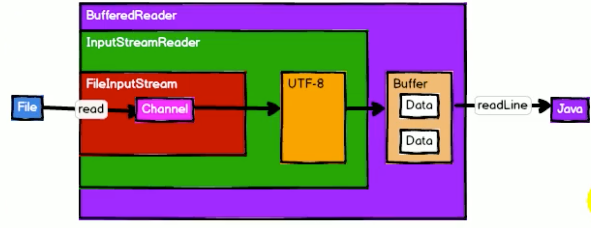
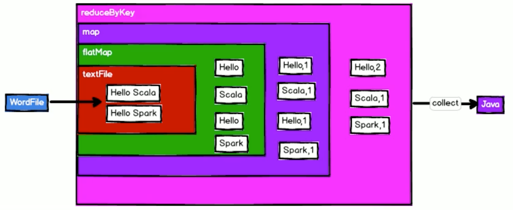

# spark-tut-parent

## Environment Settings
```text
1.maven
2.java 8
3.spark core/ml/sql
```

## Repository Notes

```text
初始化仓库
增加了maven pom files
增加了core核心例子
增加了spark ml分类和回归例子
增加了scala例子
增加了spark sql例子
```

## Spark on Yarn Tips

```text
1.spark on yarn环境配置
    1.配置hadoop
    2.配置spark env
    3.开启yarn和hdfs
    4.发送jar到yarn,查看spark on yarn的命令
2.yarn-client和yarn-cluster两种模式
3.spark on yarn的启动命令
    模式
        ./bin/spark-submit --class path.to.your.Class --master yarn \
            --deploy-mode cluster [options] <app jar> [app options]
    命令
        ./bin/spark-submit --class org.apache.spark.examples.SparkPi \
            --master yarn \
            --deploy-mode cluster或client \
            --driver-memory 4g \
            --executor-memory 2g \
            --executor-cores 1 \
            --queue thequeue \
            lib/spark-examples*.jar \
            10
    spark-shell也可以直接运行yarn模式
        cd $SPARK_HOME/bin
        ./spark-shell \
        --master yarn-client \
        --executor-memory 1G \
        --num-executors 10
4.spark on yarn的执行流程图
```


```text
5.打包相关的插件(直接见maven pom.xml)
6.文件的查找方式，一句运行环境
    本地文件：file:///opt/in
    yarn可以直接把数据放在input
    查看yarn数据源
```

## Spark Standalone Tips

```text
1.没有yarn的资源管理，则使用spark的资源管理
2.master与worker，环境相关的配置(省略）
```

## Java IO Tips

```text
1.SparkContext和Rdd
2.Java中的IO
    理解1和2之前需要了解JAVA的IO.
    输入和输出，字节和字符流
    new BufferedInputStream(new FileInputStream("")) 体现了装饰器模式
```


```text
3.RDD的函数都是将创建RDD作为参数传入，类似于Java IO
```


## Rdd

```text
RDD是弹性分布式数据集，数据抽象和逻辑抽象，是抽象类
RDD的特点是不可变，可分区，并行计算，集合
移动数据不如移动计算(Driver驱动器分配，Executor执行器上执行，最优位置解决了计算发给哪executor）
本地化：数据和计算在同一个进程中。正在计算中，另外一个分配了计算，结果就启动executor但是也在这个节点上。
节点本地化提升效率，机架本地化。
算子：转换算子 & 执行算子
RDD可以自己保持依赖，在RDD内部 @transient private var deps: Seq[Dependency[_]]
首选位置概念，节点本地化 protected def getPreferredLocations(split: Partition): Seq[String] = Nil
如何计算分区 和 那个文件放在哪个分区是两个问题。
分区map和map的区别。
```

## Source Code Reading Skills

```text
查看源码：ctrl/alt+点击 或者 alt+B 
返回前面：opt+alt+LR
到抽象类：ctrl+H查看实现面板，复制当前函数
到实现面板：搜索实现的函数
比如分析本地运行的输出文件为什么是8个分区？
makeRDD函数->defaultParallelism->defaultParallelism->接口defaultParallelism()
->ctrl+H->查看到实现...
```

## Driver and Executor

```textmate
什么是Driver？创建Spark上下文的App就是Driver，比如WordCount(发送任务).
什么是Executor？接受任务，执行任务的就是Executor(返回执行状态).
代码中的那些程序是Driver中执行的？哪些是Executor中执行的？
算子的计算功能在Executor中执行；声明sc的地方是Executor，在sc声明的地方不需要写Executor引用的变量，会增加网络的IO。
```


