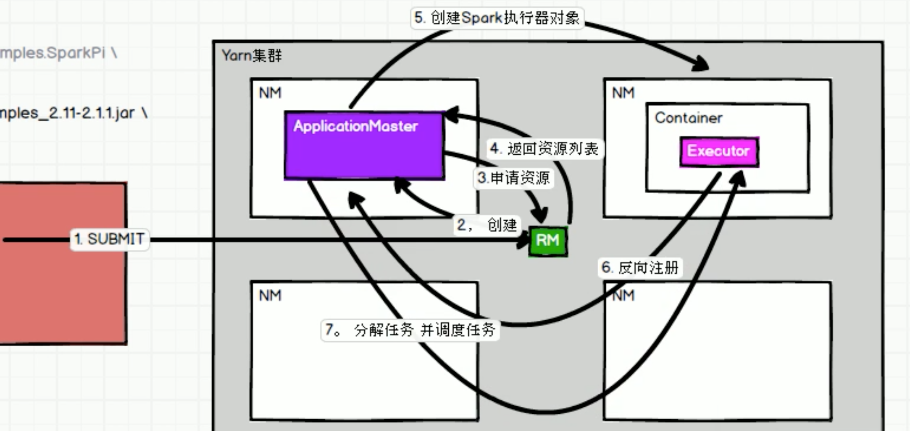

# spark-tut-parent

## environment setting 
```text
1.maven
2.java 8
```

## repos notes

```text
初始化仓库
增加了maven pom files
增加了core核心例子
增加了spark ml分类和回归例子
增加了scala例子
增加了spark sql例子
```

## spark on yarn 

```text
1.spark on yarn环境配置
    1.配置hadoop
    2.配置spark env
    3.开启yarn和hdfs
    4.发送jar到yarn,查看spark on yarn的命令
2.yarn-client和yarn-cluster两种模式
3.spark on yarn的启动命令
模式
./bin/spark-submit --class path.to.your.Class --master yarn 
    --deploy-mode cluster [options] <app jar> [app options]
命令
./bin/spark-submit --class org.apache.spark.examples.SparkPi \
    --master yarn \
    --deploy-mode cluster或client \
    --driver-memory 4g \
    --executor-memory 2g \
    --executor-cores 1 \
    --queue thequeue \
    lib/spark-examples*.jar \
    10
spark-shell也可以直接运行yarn模式
cd $SPARK_HOME/bin
./spark-shell \
--master yarn-client \
--executor-memory 1G \
--num-executors 10
```

**spark on yarn**  

